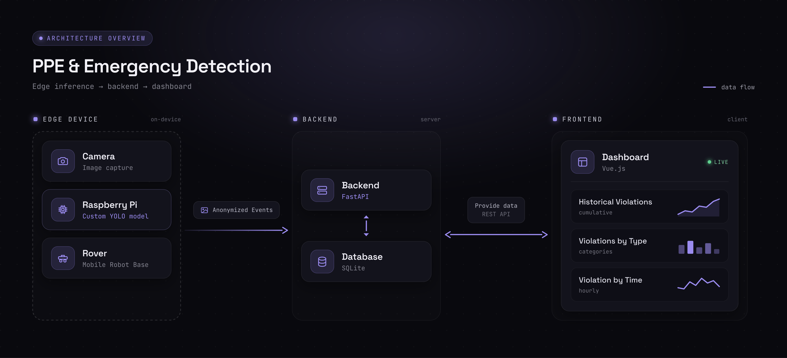

# Science Hackathon 2026 - MTU Team 1

> **AI-Based "Wingman" for Detecting PPE Violation and Emergency Situations**

---

## Problem

Factory floors require workers to wear personal protective equipment (PPE) — hardhats and safety vests — at all times. Also Workers who fall or are incapacitated may go unnoticed for critical minutes.

## Solution

An automated, real-time safety monitoring system that uses computer vision on a rover to patrol a factory floor and detect PPE violations and workers in emergency situations. Violations are anonymized and sent to a central backend, where supervisors can review them through a dashboard.

---

## Implementation

### Architecture Overview



## How to Run

See [Access File](ACCESS.md) for working credentials. Run the Backend/Frontend first, after that run the detection.

### Requirements

Create fresh Environment:

```bash
python3 -m venv .venv
```

Install Requirements:

```bash
pip install -r requirements.txt
```

### Backend

```bash
cd reporting/backend
.venv/bin/uvicorn main:app --reload --host 0.0.0.0 --port 8000
```

See [Reporting Docs](reporting/README.md) for further Information.

## Frontend

```bash

```

See [Reporting Docs](reporting/README.md) for further Information.

## Edge (Raspberry Pi)

```bash
python ppe_and_faces.py
```

Once a Violation or Emergency has been detected, the script will transmit these events to the backend for further processing.

## YOLO
The main method regarding object detection is the YOLO object detection model. Pretrained models, datasets, tests, implementations, and more are explored in [YOLO testing](yolo_stuff/README.md) and [YOLO deployment](yolo_deployment/README.md).
<br> <br>
The YOLO models are then later used on a Raspberry Pi for the image processing.

## Further Resources

- [Miro Board](https://miro.com/app/board/uXjVHDxGl7M=/?share_link_id=916344599581)
- [Presentation](https://docs.google.com/presentation/d/1EXTWaQQKHl7VqOtEcM0qJFXPZFG0Aaewyf_v4C1NydU/edit?usp=sharing)
